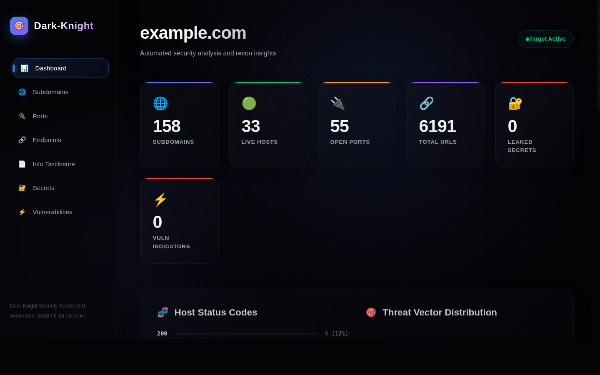

# <p align="center">🎯 Dark-Knight Security Toolkit v2.0</p>

<p align="center">
  
  
  
  
</p>

---

<p align="center">
  A state-of-the-art, fully automated cybersecurity reconnaissance and bug hunting pipeline. Orchestrates <b>27 subdomain sources</b>, multi-threaded live host analysis, and active vulnerability audits into a stunning HTML Command Dashboard.
</p>

<p align="center">
  
</p>

```text
   ___   _   ___ _  _   _  _ _  ___ _  _ _____ 
  |   \ /_\ | _ \ |/ /  | |/ / \| |_| |_|_   _|
  | |) / _ \|   / ' <   | ' <| .` | | ' \ | |  
  |___/_/ \_\_|_\_|\_\  |_|\_\_|\_|_|_||_||_|  
    ⚡ PREMIUM RECON & PIPELINE DETECTION ENGINE
```

---

## 💎 Features

* **🏎️ Ultra Fast Recon**: Concurrently runs 27 passive & active DNS search vectors.
* **🧬 WAF & Technology Audits**: Automated technology fingerprinters with smart WAF identification.
* **🔗 Complete URL Indexing**: Katana and Hakrawler engines scan deep directories to list targets.
* **🔐 JS Secrets Extraction**: Live JavaScript file downloader and parser for AWS, Google Cloud, Firebase, and GitHub tokens.
* **⚡ Vulnerability Hunters**: Pre-configured modules verifying CORS reflections, open redirects, SSRF inputs, SSTI, and LFI entrypoints.
* **📊 Glassmorphic Dashboard**: Interactive, animated Web Report containing charts, filters, and priority testing lists.

---

## ⚡ Quick Start

Start a comprehensive target scanning pipeline with one simple command:

```bash
# Clone the repository
git clone https://github.com/darkknight268/Dark_knight.git
cd Dark_knight

# Start full automated recon & bug hunting
./scripts/hunt target.com
```

---

## 📊 Pipeline Phases & Workflow

| Phase | Vector / Module | Core Tools Utilized | Target Output |
| :---: | :--- | :--- | :--- |
| **01** | **Subdomain Enumeration** | `subfinder`, `assetfinder`, `crt.sh`, `amass` | Passive & active list inside `subs.txt` |
| **02** | **IP Resolution & DNS** | `dnsx`, `shodan-ips`, `censys` | Parsed IPv4 ranges & CIDRs inside `ips.txt` |
| **03** | **Live Web Probing** | `httpx-toolkit` (80, 443, 8080, 9000, etc.) | Separation by status code inside `status_codes/` |
| **04** | **WAF Fingerprinting** | `nuclei`, `waf-detect` templates | Firewall mapping inside `technologies/` |
| **05** | **Port Scanning** | `naabu` (Top 1000 ports) | Active services mapped inside `naabu.txt` |
| **06** | **Endpoint Discovery** | `katana`, `hakrawler`, `gau`, `waybackurls` | Complete indexed crawler log `allendpoints.txt` |
| **07** | **Parameter Extraction** | `gf` patterns (xss, sqli, lfi, redirect) | Targeted payload entrypoints inside `params/` |
| **08** | **JS Static Secrets** | `mantra`, `gitleaks`, regex deep-scan | Extracted passwords and API tokens in `js_hunt/` |
| **09** | **Automated Bug Scanning** | `nuclei` (exposed-configs, panels, vulns) | Critical indicators inside `bugs/` |

---

## ⚙️ Environment Setup & Toolchain

Initialize your pipeline dependencies with these installation packages:

### 1. Install Toolchain dependencies:
```bash
# Go tools
go install -v github.com/projectdiscovery/subfinder/v2/cmd/subfinder@latest
go install -v github.com/projectdiscovery/dnsx/cmd/dnsx@latest
go install -v github.com/projectdiscovery/httpx/cmd/httpx@latest
go install -v github.com/projectdiscovery/nuclei/v3/cmd/nuclei@latest
go install -v github.com/projectdiscovery/naabu/v2/cmd/naabu@latest
go install -v github.com/projectdiscovery/katana/cmd/katana@latest
go install -v github.com/lc/gau/v2/cmd/gau@latest
go install -v github.com/tomnomnom/waybackurls@latest
go install -v github.com/tomnomnom/gf@latest
go install -v github.com/tomnomnom/qsreplace@latest
go install -v github.com/tomnomnom/hakrawler@latest
go install -v github.com/tomnomnom/kxss@latest
go install -v github.com/jaeles-project/gospider@latest

# Python packages
pip3 install paramspider gitleaks
```

### 2. Nuclei Setup:
Ensure you download the community template catalog:
```bash
nuclei -ut
```

---

## 📁 Output Directory Tree

Completed scans output all raw details, categorizations, and compiled dashboards to the directory structure below:

```text
/tmp/bug-hunter-target.com/
├── subs.txt                     # Unified unique subdomains list
├── ips.txt                      # Extracted host IPs
├── alive.txt                    # Active live endpoints
├── status_codes/                # Segregated active hosts (e.g. alive200.txt, alive403.txt)
├── allendpoints.txt             # Discovered path crawl catalog
├── params/                      # GF parameterized URL groups (e.g., xss.txt, sqli.txt)
├── jsfile.txt                   # Harvested client-side JavaScript assets
├── js_hunt/                     # Extracted credentials & access keys
├── raw/
│   ├── bugs/                    # Vulnerability hits (exposed_configs, panels, springboot)
│   └── naabu.txt                # Open port configurations
└── hunt-results/
    └── dashboard.html           # Glassmorphic UI Dashboard report
```

---

## 🔧 API Custom Configuration

Copy the default keys config file to add API keys (e.g. Shodan, Censys, VirusTotal, Redhunt) for increased search coverage:

```bash
cd scripts
cp recon.cfg recon.cfg.local
# Edit recon.cfg.local with your keys
```
> ⚠️ **IMPORTANT**: Never commit your API keys or `recon.cfg.local` to public repositories. Ensure they remain ignored by git.

---

## 🤝 Contribution Guidelines

Contributions are welcome! Please make sure to follow these:
* Keep all script pipeline commands modular.
* Append `|| true` or output redirections `2>/dev/null` where failures are expected, so the core automation script never terminates prematurely.
* Maintain clean console colors by utilizing terminal definitions (`$O`, `$WH`, `$DG`, `$G`).

---

<p align="center">
  <b>Dark-Knight Security Toolkit</b> is developed and maintained for security auditing and authorized defensive verification. Use responsibly.
</p>mpty values, and tell users to copy it.

## Contributing

PRs welcome. Keep it modular, add `|| true` to all commands so failures don't halt the pipeline.
